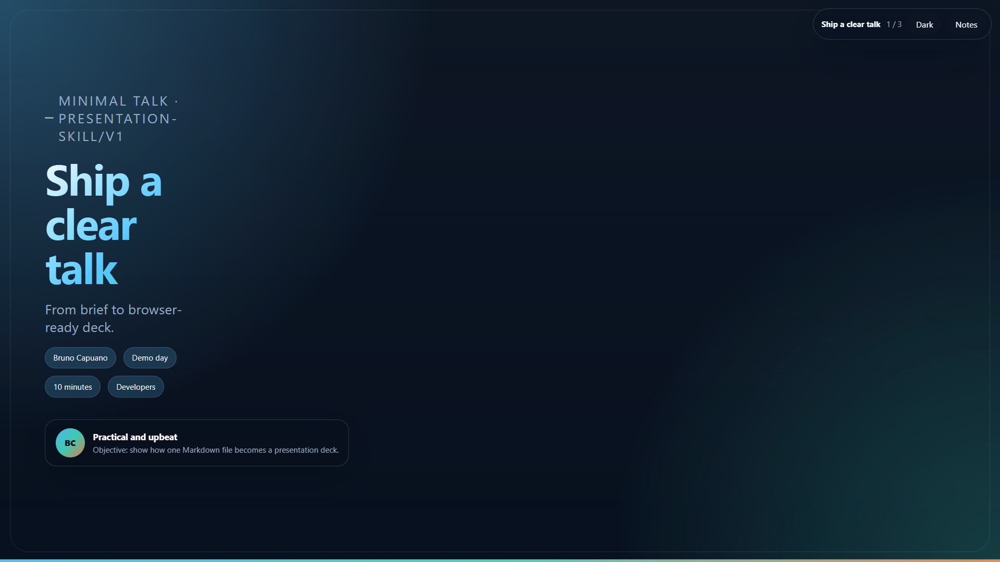
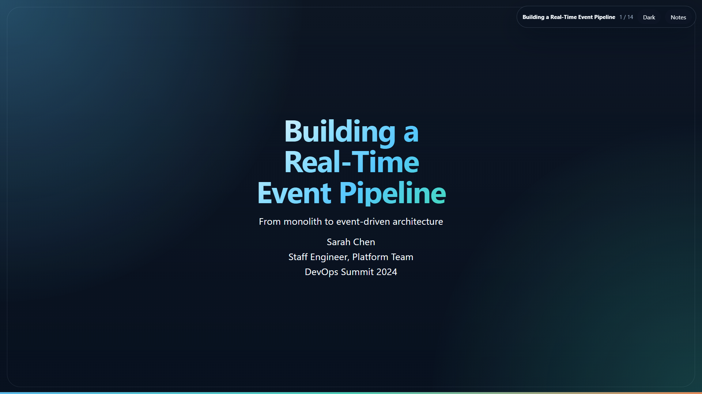
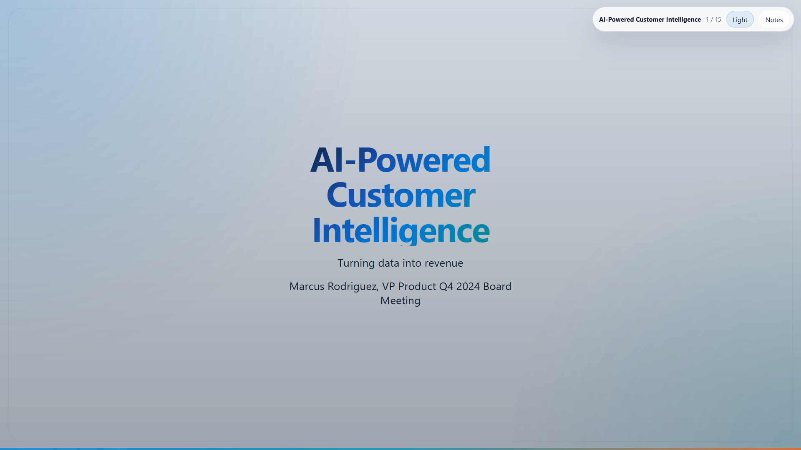
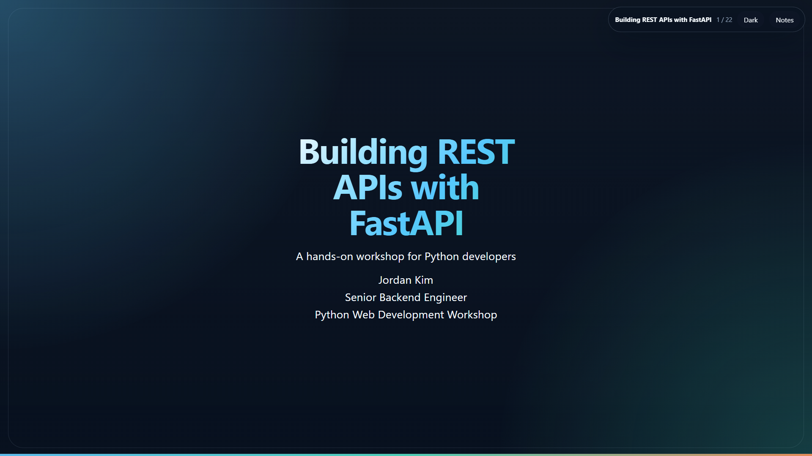

# md-to-slides

A skill for GitHub Copilot and Claude Code that turns Markdown presentation outlines into self-contained HTML decks.

## Getting Started

The package now ships the `md2slides` CLI alongside the skill assets.

1. `npm install md-to-slides`
2. Run the packaged CLI from your project root:

```bash
npm install md-to-slides
npx md2slides init
```

If you install the package globally, or your environment already exposes local npm bins on `PATH`, the same command is simply:

```bash
md2slides init
```

If you want direct-file usage, portable skill installs, or other setup variants, use the docs linked below instead of the main onboarding path.

## Learn the workflow

- [docs/quickstart.md](docs/quickstart.md) — npm-first quickstart and current CLI status
- [docs/install-options.md](docs/install-options.md) — portable skill-folder, script, archive, and clone-based installs
- [docs/architecture-overview.md](docs/architecture-overview.md) — contract, templates, examples, and portability model
- [docs/repository-structure.md](docs/repository-structure.md) — repository layout and folder ownership
- [docs/testing.md](docs/testing.md) — root validation flow, fixtures, and release checks
- [docs/automation.md](docs/automation.md) — GitHub Actions and screenshot automation
- [docs/publishing.md](docs/publishing.md) — publishing and package status

## Quick Example

```text
Use the presentation skill to create a 5-slide deck about adopting TypeScript.
Title: "Why TypeScript?" Audience: JavaScript developers. Tone: practical.
```

The workflow produces a single `slides.html` file you can open in any browser.

## Visual Examples

| Minimal Talk | Technical Talk |
| --- | --- |
| [](examples/minimal-talk/slides.html)<br>Clean starter deck. [Open →](examples/minimal-talk/slides.html) | [](examples/technical-talk/slides.html)<br>Code-heavy engineering presentation. [Open →](examples/technical-talk/slides.html) |

| Executive Pitch | Workshop Tutorial |
| --- | --- |
| [](examples/executive-pitch/slides.html)<br>Concise business-facing narrative. [Open →](examples/executive-pitch/slides.html) | [](examples/workshop-tutorial/slides.html)<br>Hands-on teaching flow with guided steps. [Open →](examples/workshop-tutorial/slides.html) |

## Contributing

Contributions welcome. Start with [docs/repository-structure.md](docs/repository-structure.md) and [docs/testing.md](docs/testing.md).

## License

MIT License. See [LICENSE](LICENSE) for full text.

Copyright (c) Bruno Capuano & Contributors
